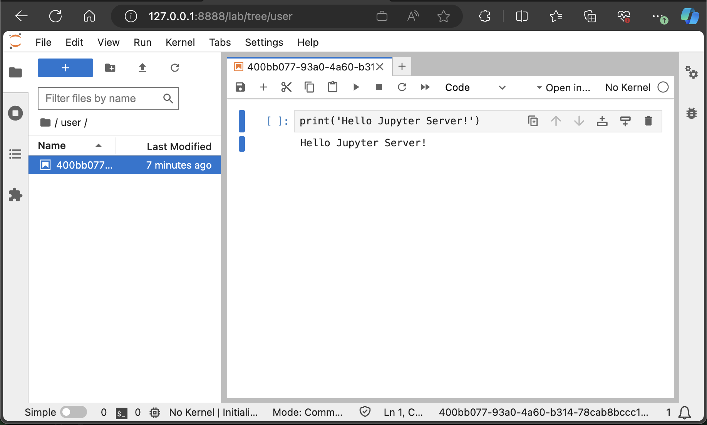

# Configuring a Jupyter Server

**TL;DR:** This page provides a step-by-step guide on setting up a Jupyter Server, including creating a Dockerfile with necessary libraries, building a Docker container for different architectures, and running and testing the server locally. It also covers the integration of LangChain JS and Azure OpenAI to generate and execute code.

## 4.1 Selecting a Jupyter Server image

There is extensive documentation on [Jupyter Docker Stacks](https://jupyter-docker-stacks.readthedocs.io/en/latest/index.html) providing guidance on how to select a stack including details on the tools and features included in each. I recommend reading through this documentation to understand the options available if the stack we have selected does not work for you.

I selected the [jupyter/base-notebook](https://jupyter-docker-stacks.readthedocs.io/en/latest/using/selecting.html#jupyter-base-notebook) stack for its minimal yet sufficient featureset for our use case, including:

- Everything in `jupyter/docker-stacks-foundation`
- Minimally functional Server (e.g., no LaTeX support for saving notebooks as PDFs)
- `notebook`, `jupyterhub`, and `jupyterlab` packages
- A `start-notebook.py` script as the default command
- A `start-singleuser.py` script useful for launching containers in JupyterHub
- Options for a self-signed HTTPS certificate

## 4.2 Creating our custom Dockerfile

Creating a custom Jupyter Server container image is straightforward. We begin by creating a `requirements.txt` file at the project's root, listing all libraries we would like the assistant to use in code execution. I have listed a few below that I have observed GPT4 will typically attempt to use.

```txt
numpy
matplotlib
pandas
openpyxl
PyPDF2
```

Using the chosen image as our base layer, we copy the requirements file and install these libraries using the base Conda environment.

```Dockerfile
FROM quay.io/jupyter/base-notebook:latest

# Install packages to use for Code Interpretation
COPY requirements.txt /
RUN conda install -y --file /requirements.txt

# Temporarily switch to root to create and modify /mnt/data
USER root

# Create the /mnt/data directory
RUN mkdir -p /mnt/data

# Change the ownership of the /mnt/data directory to the jovyan user
# jovyan is the default user in Jupyter Docker images
RUN chown jovyan:users /mnt/data

# Set the appropriate permissions for the /mnt/data directory
# 770 grants full permissions (read, write, execute) to the owner (jovyan)
# and read-write permissions to the group (users)
RUN chmod 770 /mnt/data
```

And that's it! We now have our own custom Jupyter Server image.

## 4.3 Building our custom Dockerfile

If you are planning to eventually deploy a JupyterHub instance, consider your target platform. This guide demonstrates deployment to Azure Kubernetes Service, which required building the container for arm64. Because of that, I am using the docker buildx command to build the container for both amd64 and arm64.

```shell
# Create a new builder instance
docker buildx create --use --platform=linux/amd64 --name jupyter-server-builder
# Verify the builder instance
docker buildx inspect jupyter-server-builder --bootstrap
# Build the container
docker buildx build --platform=linux/amd64 --tag myacr.azurecr.io/interpreter:latest --load -f ./packages/open-data-analysis/Dockerfile ./packages/open-data-analysis
```

## 4.4 Running and testing the container locally:

To test locally, run:

```shell
docker run --name interpreter -p 8888:8888 myacr.azureacr.io/interpreter
```

Once the server starts, you should see output similar to:

```
2023-11-30 22:33:21 [I 2023-12-01 03:33:21.563 ServerApp] Jupyter Server 2.10.1 is running at:
2023-11-30 22:33:21 [I 2023-12-01 03:33:21.563 ServerApp] http://839752b66aef:8888/lab?token=8eeeae6feee65e5dd2072aab8023a68d0f0f41d6c4b500ee
2023-11-30 22:33:21 [I 2023-12-01 03:33:21.563 ServerApp]     http://127.0.0.1:8888/lab?token=8eeeae6feee65e5dd2072aab8023a68d0f0f41d6c4b500ee
```

Jot down the authentication token for later use (`?token=...`). You can now access the Jupyter Lab interface for your containerized server via the link in the output.

## 4.5 Running the Jupyter Server example

This doumentation uses [LangChain JS](https://js.langchain.com/) and [Azure OpenAI](https://learn.microsoft.com/en-us/azure/ai-services/openai/overview) for code interpretation. Alternatively, you may configure the example to use OpenAI or other compatible services and frameworks.

Create a `.env` file in the 'examples' package with the following variables:

```env
JUPYTER_URL=127.0.0.1:8888
JUPYTER_TOKEN=
AZURE_OPENAI_API_KEY=
AZURE_OPENAI_API_INSTANCE_NAME=
AZURE_OPENAI_API_DEPLOYMENT_NAME=
AZURE_OPENAI_API_VERSION=2023-08-01-preview
```

This example uses `pnpm`, which can be easily enabled or installed [using corepack](https://pnpm.io/installation#using-corepack).

```shell
corepack enable
corepack prepare pnpm@latest --activate
```

Install dependencies and build the package:

```shell
pnpm install
pnpm --filter open-data-analysis build
```

To run the example, use the `launch.json` configurations in VSCode (F5 or play) or execute `pnpm run start:server`.

Interacting with the assistant should now execute code on the Jupyter Server:

```shell
You: Execute some code that prints Hello Jupyter Server!
Starting WebSocket: ws://127.0.0.1:8888/api/kernels/ce9fc73f-eb89-4dac-a867-3b88a0effec3
Assistant: The code has been executed and it printed: "Hello Jupyter Server!"
```

In the Jupyter Lab interface, you'll find a user directory with a notebook containing the executed code and its results.



It's my understanding the WebSocket messages from `@jupyterlabs/services` should only be visible in the terminal when running with `NODE_ENV=development`.

Leveraging [`@jupterlab/services`](https://github.com/jupyterlab/jupyterlab) or the [Jupyter Lab API](https://jupyter-server.readthedocs.io/en/latest/developers/rest-api.html) from a [LangChain Tool](https://js.langchain.com/docs/modules/agents/tools/), we gain considerable flexibility in handling diverse interactions with our Jupyter Server. You can handle a wide range of outputs, support a number of language kernels (e.g., Python, R, Julia), upload and download content...

Additionally, as you may recall from the system prompt, OpenAI's Advanced Data Analysis feature also uses a `Tool` for interacting with its stateful Jupyter notebook environment.

At this point I would suggest that you explore the source code in `src/server_too_example.ts`, `src/tools/ServerCodeInterpreter.ts` and `src/utils/jupyterServerUtils.ts` to familiarize yourself with some of the concepts. I have annotated the code with comments for clarity.

[Previous: Key Investigation](./3_key_investigation.md) | [Next: Configuring a Jupyter Hub](./5_configuring_a_jupyter_hub.md)  
[Table of Contents](../README.md)
